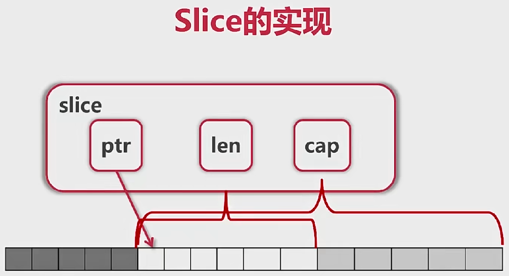

# 数组

## 创建数组

```go
func main() {
    var arr1 [5]int
    arr2 := [5]int{1, 2, 3, 4, 5}
    arr3 := [...]int{1, 2, 3, 4, 5}
    var grid [4][5]int
    fmt.Println(arr1, arr2, arr3)
    fmt.Println(grid)
    
}
```

## 函数数组传值

```go
func printArray(arr *[5]int) {
    arr[0] = 100
    for _, v := range arr {
       fmt.Println(v)
    }
}

func main() {
    var arr1 [5]int
    arr2 := [5]int{1, 2, 3, 4, 5}
    printArray(&arr1)
    printArray(&arr2)
    fmt.Println(arr2)
}
```

## 数组切片

```go
func updateSlice(s []int) {
	s[0] = 100
}

func printSliceLenCap(slice []int) {
	fmt.Printf("slice=%v, len=%d, cap=%d\n", slice, len(slice), cap(slice))
}

func main() {
	fmt.Println("---------------slice--------------")
	arr := [...]int{0, 1, 2, 3, 4, 5, 6, 7, 8, 9}
	fmt.Println("arr[2:6} =", arr[2:6])
	fmt.Println("arr[:6] =", arr[:6])
	fmt.Println("arr[2:] =", arr[2:])
	fmt.Println("arr[:] =", arr[:])

	// 切片更新数值，原数组数值同样改变
	fmt.Println("---------------update slice--------------")
	s1 := arr[2:6]
	fmt.Println("before s1:", s1)
	updateSlice(s1)
	fmt.Println("after s1:", s1)
	fmt.Println("arr:", arr)

	// reslice
	fmt.Println("---------------reslice--------------")
	s2 := arr[:5]
	fmt.Println("s2:", s2)
	s2 = s2[2:]
	fmt.Println("s2:", s2)

	// slice的拓展
	fmt.Println("---------------slice的扩展--------------")
	s1 = arr[2:6]
	s2 = s1[3:5] // s2越界访问了s1，但是不会报错，因为它本质上是访问了arr
	// 注意：slice可以向后扩展，但是不能向前扩展
	fmt.Println("arr:", arr)
	fmt.Println("s1:", s1)
	fmt.Println("s2:", s2)
	fmt.Printf("len(s1)=%d, cap(s1)=%d\n", len(s1), cap(s1))
	fmt.Printf("len(s2)=%d, cap(s2)=%d\n", len(s2), cap(s2))

	// slice添加元素
	fmt.Println("---------------slice的append--------------")
	s3 := append(s2, -1)
	s4 := append(s3, -2)
	s5 := append(s4, -3)
	// 添加元素时如果超越cap，系统会重新分配更大的底层数组
	fmt.Println("s3, s4, s5 :", s3, s4, s5)
	fmt.Println("arr :", arr)

	// 从零创建slice
	fmt.Println("---------------从零创建slice--------------")
	var s []int // zero value for slice is nil
	if s == nil {
		fmt.Println("s is nil!")
	}
	for i := 0; i < 100; i++ {
		//printSliceLenCap(s)
		s = append(s, i) // 添加元素时，数组的cap容量按照2的指数增加，1，2，4，8 ...
	}
	fmt.Println("s:", s)
	// 可以使用make手动分配slice的len和cap
	s1 = []int{0, 1, 2, 3, 4}
	printSliceLenCap(s1)
	s2 = make([]int, 16) // len=16, cap=16
	printSliceLenCap(s2)
	s3 = make([]int, 16, 32) // len=16, cap=32
	printSliceLenCap(s3)

	// slice的拷贝
	fmt.Println("---------------slice的拷贝--------------")
	s1 = []int{0, 1, 2, 3, 4}
	s2 = make([]int, 16, 32)
	fmt.Print("before copy: ")
	printSliceLenCap(s2)
	copy(s2, s1) // 拷贝后，s2的len和cap不变，如果s2的len和cap小于s1，那么只会拷贝一部分
	fmt.Print("after copy: ")
	printSliceLenCap(s2)

	// slice删除元素
	fmt.Println("---------------slice删除元素--------------")
	s1 = []int{0, 1, 2, 3, 4}
	printSliceLenCap(s1)
	fmt.Println("删除下标为2的元素: ")
	s1 = append(s1[:2], s1[3:]...)
	printSliceLenCap(s1)
	fmt.Println("删除头部元素")
	s1 = s1[1:]
	printSliceLenCap(s1)
	fmt.Println("删除尾部元素")
	s1 = s1[:len(s1)-1]
	printSliceLenCap(s1)
}
```

slice 本身没有数据，是对底层array的一个view



# map

```go
// LCR 016. 无重复字符的最长子串
func lengthOfLongestSubstring(s string) int {
    start, maxLen := 0, 0
    m := make(map[byte]int)
    for i, ch := range []byte(s) {
       if lastI, ok := m[ch]; ok && lastI >= start {
          start = lastI
       }
       maxLen = max(maxLen, i-start+1)
       m[ch] = i
    }
    return maxLen
}

func main() {
    // map初始化
    fmt.Println("------------------------------map初始化------------------------------")
    // 除了slice、map、function的内建类型都可以作为key
    // Struct类型不包含上述字段，也可作为key
    var m = map[string]string{
       "name":    "ccmouse",
       "course":  "golang",
       "site":    "imooc",
       "quality": "notbad",
    }
    m2 := make(map[string]int) // m2 == empty
    var m3 map[string]int      // m3 == nil
    fmt.Println(m, m2, m3)

    for k, v := range m {
       fmt.Println(k, v)
    }

    fmt.Println()
    courseName := m["course"] // courseName=golang
    fmt.Println(courseName)
    if causeName, ok := m["cause"]; ok {
       fmt.Println(causeName)
    } else {
       fmt.Println("key not found")
    }

    length := lengthOfLongestSubstring("abcabcbb")
    fmt.Println(length)
}
```

# 字符和字符串

```go
func main() {
    s := "Yes我爱玩我爱玩我爱玩" // UTF-8：中文字符占三字节，英文字符占一字节
    fmt.Printf("%x\n", []byte(s))
    for _, b := range []byte(s) {
       fmt.Printf("%x ", b)
    }
    fmt.Println()
    for i, ch := range s { // ch is a rune
       fmt.Printf("(%d:%x) ", i, ch) // Unicode编码：中文占两个字节
    }
    fmt.Println()
    fmt.Println("rune count:", utf8.RuneCountInString(s))

    bytes := []byte(s)
    for len(bytes) > 0 {
       ch, size := utf8.DecodeRune(bytes)
       fmt.Printf("(ch=%c,x=%x size=%d)\n", ch, ch, size)
       bytes = bytes[size:]
    }
}
```

