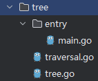

# 基本方法

```go
package main

import "fmt"

type TreeNode struct {
    value       int
    left, right *TreeNode
}

func (node *TreeNode) print() {
    fmt.Print(node.value, " ")
}

func (node *TreeNode) traverse() {
    if node == nil {
       return
    }
    node.left.traverse()
    node.print()
    node.right.traverse()
}

func (node *TreeNode) setValue(value int) {
    node.value = value
}

func createNode(val int) *TreeNode {
    return &TreeNode{value: val}
}

func main() {
    root := TreeNode{value: 3}
    root.left = &TreeNode{}
    root.right = &TreeNode{5, nil, nil}
    root.right.left = new(TreeNode)
    root.left.right = createNode(2)
    root.print()
    fmt.Println()
    root.right.left.setValue(123)
    root.right.left.print()
    fmt.Println()
    root.traverse()
    
    fmt.Println()
    fmt.Println(root)
}
```

# 封装



main.go

```go
package main

import (
    "awesomeProject/tree"
    "fmt"
)

func main() {
    root := tree.Node{Value: 3}
    root.Left = &tree.Node{}
    root.Right = &tree.Node{Value: 5}
    root.Right.Left = new(tree.Node)
    root.Left.Right = tree.CreateNode(2)
    root.Print()
    fmt.Println()
    root.Right.Left.SetValue(123)
    root.Right.Left.Print()
    fmt.Println()
    root.Traverse()
    fmt.Println()
    fmt.Println(root)
}
```

traversal.go

```go
package tree

func (node *Node) Traverse() {
    if node == nil {
       return
    }
    node.Left.Traverse()
    node.Print()
    node.Right.Traverse()
}
```

tree.go

```go
package tree

import "fmt"

type Node struct {
    Value       int
    Left, Right *Node
}

func (node *Node) Print() {
    fmt.Print(node.Value, " ")
}

func (node *Node) SetValue(Value int) {
    node.Value = Value
}

func CreateNode(val int) *Node {
    return &Node{Value: val}
}
```

# 扩充已有类型

